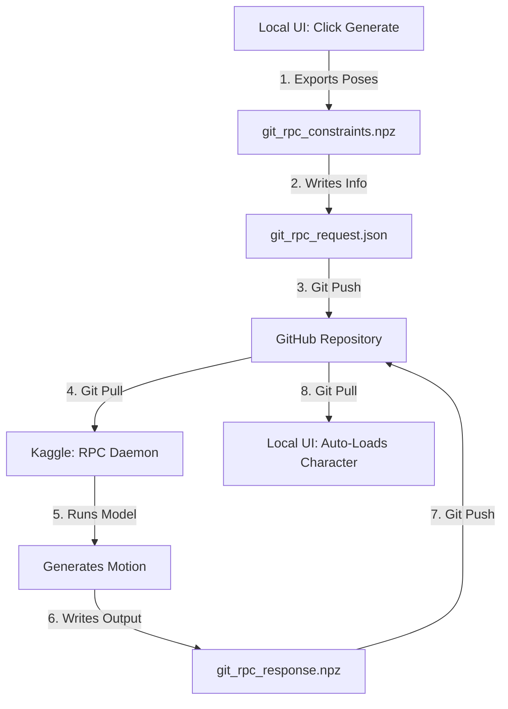

# Guide: Git-RPC Bridge Workflow (GPU-over-Git)

This guide outlines how to connect your lightweight local Viser UI editor with your high-power Kaggle GPU instance in real-time, communicating asynchronously via GitHub. 



Since the local UI is patched to intercept the **Generate** button, it will automatically handle saving, pushing, pulling, and loading the animation data back into your 3D viewport.

---

## Phase 1: Local Git Initialization

To let the script push and pull requests, we need to initialize a Git repository in your project directory:

1. Open a Command Prompt or PowerShell:
   ```cmd
   cd C:\Users\DELL\Desktop\osas\streaming\naruto_next_generation_of_losser
   git init
   git add .
   git commit -m "Initial commit"
   ```
2. Create a new repository on GitHub (e.g. `naruto-mocap`), and link it:
   ```cmd
   git remote add origin https://github.com/your_username/your-repo.git
   git branch -M main
   git push -u origin main
   ```

---

## Phase 2: Start the Local Viser Client

Your local script [local_no_model_ui.py](file:///C:/Users/DELL/Desktop/osas/streaming/environment/local_no_model_ui.py) and [git_rpc.py](file:///C:/Users/DELL/Desktop/osas/streaming/environment/git_rpc.py) are already configured to act as the Git client!

1. Restart the local server (if it was stopped):
   ```cmd
   cd C:\Users\DELL\Desktop\osas\streaming\environment
   & "C:\Program Files\Blender Foundation\Blender 5.1\5.1\python\bin\python.exe" local_no_model_ui.py
   ```
2. Open `http://localhost:7860` in your web browser.

---

## Phase 3: Start the Kaggle RPC Daemon

This script runs on Kaggle. It loads the Kimodo model **once** in VRAM, then polls GitHub every 5 seconds for incoming requests. Because the model is preloaded, motion generation takes only **10–15 seconds**!

### Kaggle Notebook Script:

```python
import os
import sys
import json
import time
import torch
import numpy as np
from unittest.mock import patch
from kaggle_secrets import UserSecretsClient

# 1. Load Secure Tokens
try:
    user_secrets = UserSecretsClient()
    os.environ["HF_TOKEN"] = user_secrets.get_secret("HF_TOKEN")
    gh_token = user_secrets.get_secret("GH_TOKEN")
    print("✓ Tokens loaded successfully!")
except Exception:
    print("Warning: Add HF_TOKEN and GH_TOKEN to Kaggle Secrets.")

# --- CONFIGURE YOUR GIT DETAILS HERE ---
GH_USER = "TherealE2O"
GH_EMAIL = "osasodiasea1@gmail.com"
GH_REPO = "github.com/TherealE2O/realtime-ai-animation"
PROJECT_DIR = "/kaggle/working/my_project"

# Ensure repo is cloned
if not os.path.exists(PROJECT_DIR):
    !git clone https://{gh_token}@{GH_REPO}.git {PROJECT_DIR}
else:
    %cd {PROJECT_DIR}
    !git pull

# Git Helper
def run_git(args, cwd=PROJECT_DIR):
    import subprocess
    result = subprocess.run(["git"] + args, cwd=cwd, capture_output=True, text=True)
    if result.returncode != 0:
        print(f"[Git Error] {result.stderr.strip()}")
    return result.returncode == 0

# Configure Git user on Kaggle
!git config --global user.name "{GH_USER}"
!git config --global user.email "{GH_EMAIL}"

# 2. Apply VRAM Optimizations
torch.multiprocessing.set_sharing_strategy('file_system')
os.environ["HF_DEACTIVATE_ASYNC_LOAD"] = "1"
os.environ["PYTORCH_ALLOC_CONF"] = "expandable_segments:True"
os.environ["TEXT_ENCODER_DEVICE"] = "cuda"

# 3. Patch & Load LLM2Vec
from kimodo.model.llm2vec.llm2vec import LLM2Vec
original_from_pretrained = LLM2Vec.from_pretrained

def patched_from_pretrained(cls, base_model_name_or_path, *args, **kwargs):
    from transformers import BitsAndBytesConfig
    bnb_config = BitsAndBytesConfig(
        load_in_4bit=True,
        bnb_4bit_compute_dtype=torch.float16,
        bnb_4bit_use_double_quant=True,
        bnb_4bit_quant_type="nf4"
    )
    kwargs["quantization_config"] = bnb_config
    kwargs["device_map"] = "auto"
    kwargs["low_cpu_mem_usage"] = True
    return original_from_pretrained(base_model_name_or_path, *args, **kwargs)

# Load model using the patched loader
from kimodo.model.load_model import load_model

print("🤖 Initializing memory-guarded Kimodo model on GPU...")
with patch.object(LLM2Vec, "from_pretrained", classmethod(patched_from_pretrained)), \
     patch("torch.cuda.device_count", return_value=1), \
     patch("transformers.modeling_utils.caching_allocator_warmup", return_value=None):
    model = load_model("Kimodo-SOMA-RP-v1.1", device="cuda:0")
print("✓ Model loaded successfully!")

# 4. Polling Loop
print("👀 Listening for requests from local PC...")
while True:
    # Clean state fetch + reset to avoid branch divergence on the Kaggle worker
    run_git(["fetch", "origin", "main"])
    run_git(["reset", "--hard", "origin/main"])
    
    status_path = os.path.join(PROJECT_DIR, "git_rpc_status.txt")
    request_path = os.path.join(PROJECT_DIR, "git_rpc_request.json")
    constraints_path = os.path.join(PROJECT_DIR, "git_rpc_constraints.npz")
    response_path = os.path.join(PROJECT_DIR, "git_rpc_response.npz")
    
    if os.path.exists(status_path):
        with open(status_path, "r") as f:
            status = f.read().strip()
            
        if status == "request":
            print("\n[RPC] Request detected! Setting status to 'processing'...")
            with open(status_path, "w") as f:
                f.write("processing")
            run_git(["add", "git_rpc_status.txt"])
            run_git(["commit", "-m", "RPC: Processing request"])
            run_git(["push", "origin", "main"])
            
            try:
                # Load metadata
                with open(request_path, "r") as f:
                    req = json.load(f)
                
                print(f"[RPC] Generating motion for prompt: {req['prompts']}")
                
                # Load constraints list (robust fallback for prompt-only generation)
                model_constraints = []
                if os.path.exists(constraints_path):
                    from kimodo.constraints import load_constraints_lst
                    try:
                        model_constraints = load_constraints_lst(constraints_path, skeleton=model.skeleton)
                        for constraint in model_constraints:
                            constraint.to("cuda:0")
                    except Exception as e:
                        print(f"No valid constraints loaded: {e}")
                
                # Run Generation
                with torch.no_grad():
                    pred_joints_output = model(
                        req["prompts"],
                        req["num_frames"],
                        diffusion_steps=50,
                        multi_prompt=True,
                        constraint_lst=model_constraints,
                        cfg_weight=[2.0, 2.0],
                        num_samples=req["num_samples"],
                        cfg_type=None
                    )
                
                # Save response
                posed_joints = pred_joints_output["posed_joints"].cpu().numpy()
                global_rot_mats = pred_joints_output["global_rot_mats"].cpu().numpy()
                response_data = {
                    "posed_joints": posed_joints,
                    "global_rot_mats": global_rot_mats
                }
                if "foot_contacts" in pred_joints_output:
                    response_data["foot_contacts"] = pred_joints_output["foot_contacts"].cpu().numpy()
                    
                np.savez_compressed(response_path, **response_data)
                
                # Clean up constraints file to prevent reuse in prompt-only runs
                if os.path.exists(constraints_path):
                    os.remove(constraints_path)
                
                # Mark as done
                with open(status_path, "w") as f:
                    f.write("done")
                
                print("[RPC] Commit and push response back to GitHub...")
                run_git(["add", "git_rpc_response.npz", "git_rpc_status.txt"])
                # Also stage removal of constraints file
                if not os.path.exists(constraints_path):
                    run_git(["rm", "git_rpc_constraints.npz"])
                run_git(["commit", "-m", "RPC: Motion generation complete"])
                run_git(["push", "-f", "origin", "main"])
                print("[RPC] Response sent successfully!")
                
            except Exception as e:
                print(f"[RPC Error] Generation failed: {e}")
                with open(status_path, "w") as f:
                    f.write("error")
                run_git(["add", "git_rpc_status.txt"])
                run_git(["commit", "-m", "RPC: Generation error"])
                run_git(["push", "-f", "origin", "main"])
                
    time.sleep(5)
```
