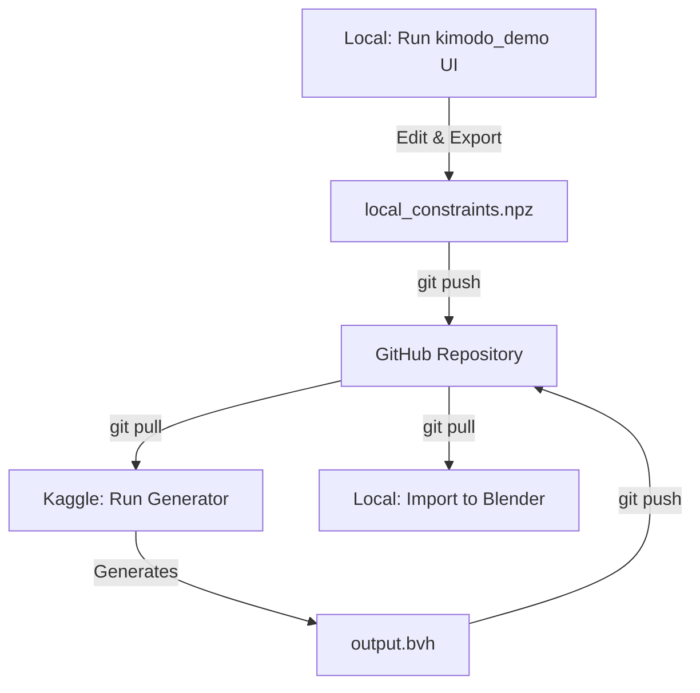

# Guide: Git-Synced Motion Generation Workflow

This guide details a Git-based synchronization workflow to design your keyframe constraints locally (without loading heavy model weights), send them to Kaggle for generation, and automatically retrieve the generated `.bvh` animations back to your computer.



---

## Phase 1: Local Constraint Design (No Model)

Since the `kimodo_demo` UI loads model weights *lazily* (only when clicking the "Generate" button), you can run the UI locally solely to edit and export your keyframes.

1. **Launch the UI locally** in your command line:
   ```cmd
   cd C:\Users\DELL\Desktop\osas\streaming\environment
   kimodo_demo
   ```
2. Open `http://localhost:7860` in your web browser.
3. Use the timeline and joint rotation tools to set your key poses (e.g. Frame 0: standing, Frame 60: hand at waist, Frame 120: crouch).
4. Click **Export Constraints** to save them as `knife_draw_constraints.npz`.
5. Move this file to your local Git repository folder, commit, and push it:
   ```cmd
   git add knife_draw_constraints.npz
   git commit -m "Added knife draw constraints"
   git push origin main
   ```

---

## Phase 2: Kaggle Automation Script

This script automatically pulls your constraints from GitHub, runs the memory-guarded Kimodo generation on the Kaggle GPU, and pushes the output `.bvh` files back to your GitHub repository.

### Prerequisites:
1. Create a **Personal Access Token (PAT)** on GitHub (Settings -> Developer Settings -> Personal Access Tokens -> Tokens classic). Give it `repo` write permissions.
2. In your Kaggle Notebook, click **Add-ons -> Secrets** and add:
   * **`HF_TOKEN`**: *Your Hugging Face token*
   * **`GH_TOKEN`**: *Your GitHub Personal Access Token*

### Kaggle Notebook Code:

```python
import os
import sys
import torch
from unittest.mock import patch
from kaggle_secrets import UserSecretsClient

# 1. Load secure tokens
try:
    user_secrets = UserSecretsClient()
    os.environ["HF_TOKEN"] = user_secrets.get_secret("HF_TOKEN")
    gh_token = user_secrets.get_secret("GH_TOKEN")
    print("✓ Tokens successfully loaded!")
except Exception:
    print("Warning: Make sure HF_TOKEN and GH_TOKEN are added under Add-ons -> Secrets.")

# --- CONFIGURE YOUR GIT DETAILS HERE ---
GH_USER = "your_github_username"
GH_EMAIL = "your_email@example.com"
GH_REPO = "github.com/your_username/your_repo_name"  # Exclude the https:// prefix

# Configure Git on Kaggle
!git config --global user.name "{GH_USER}"
!git config --global user.email "{GH_EMAIL}"

# 2. Clone or pull your project repository
PROJECT_DIR = "/kaggle/working/my_project"
if not os.path.exists(PROJECT_DIR):
    !git clone https://{gh_token}@{GH_REPO}.git {PROJECT_DIR}
else:
    %cd {PROJECT_DIR}
    !git pull

# 3. Apply VRAM optimizations for Kimodo
torch.multiprocessing.set_sharing_strategy('file_system')
os.environ["HF_DEACTIVATE_ASYNC_LOAD"] = "1"
os.environ["PYTORCH_ALLOC_CONF"] = "expandable_segments:True"
os.environ["TEXT_ENCODER_DEVICE"] = "cuda"

# 4. Patch & Load LLM2Vec
from kimodo.model.llm2vec.llm2vec import LLM2Vec
original_from_pretrained = LLM2Vec.from_pretrained

def patched_from_pretrained(cls, base_model_name_or_path, *args, **kwargs):
    from transformers import BitsAndBytesConfig
    bnb_config = BitsAndBytesConfig(
        load_in_4bit=True,
        bnb_4bit_compute_dtype=torch.float16,
        bnb_4bit_use_double_quant=True,
        bnb_4bit_quant_type="nf4"
    )
    kwargs["quantization_config"] = bnb_config
    kwargs["device_map"] = "auto"
    kwargs["low_cpu_mem_usage"] = True
    return original_from_pretrained(base_model_name_or_path, *args, **kwargs)

# CD to the Kimodo script folder
%cd /kaggle/working/kimodo
from kimodo.scripts.generate import main as kimodo_main

# Set paths inside your cloned git repository
CONSTRAINT_FILE = f"{PROJECT_DIR}/knife_draw_constraints.npz"
OUTPUT_DIR = f"{PROJECT_DIR}/output"
os.makedirs(OUTPUT_DIR, exist_ok=True)

sys.argv = [
    "kimodo_gen",
    "--model", "Kimodo-SOMA-RP-v1.1",
    "--duration", "4.5",
    "--num_samples", "3",
    "--seed", "42",
    "--bvh",
    "--constraints", CONSTRAINT_FILE,
    "--save_example_dir", OUTPUT_DIR,  # Output files directly inside the git repo
    "he reaches to his waist draw his knife"
]

print("🚀 Launching generation loop using constraints...")
with patch.object(LLM2Vec, "from_pretrained", classmethod(patched_from_pretrained)), \
     patch("torch.cuda.device_count", return_value=1), \
     patch("transformers.modeling_utils.caching_allocator_warmup", return_value=None):
    kimodo_main()

# 5. Push output animations back to GitHub
%cd {PROJECT_DIR}
!git add .
!git commit -m "Auto-generated animations from Kaggle"
!git push origin main
print("✓ Outputs successfully committed and pushed back to GitHub!")
```

---

## Phase 3: Local Retrieval & Blender Import

Once the Kaggle cell completes:
1. Run `git pull` in your local project folder to receive the `.bvh` files.
2. In Blender, run your automation script to import and frame the animations!
